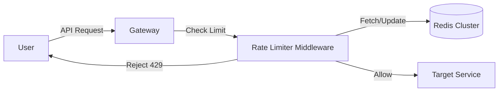

# High-Level Design: Token Bucket Rate Limiter

## 1. Architecture Overview
We will implement a distributed rate limiter using **Redis** as the centralized state store to support our multi-node cluster.

## 2. Component Diagram

## 3. Algorithm Choice
We have chosen the **Token Bucket** algorithm over Fixed Window to allow for traffic bursts while maintaining a strict long-term average rate.

## 4. Data Schema
- Key: `ratelimit:{api_key}`
- Value: Hash map containing `tokens` (float) and `last_updated` (timestamp).
