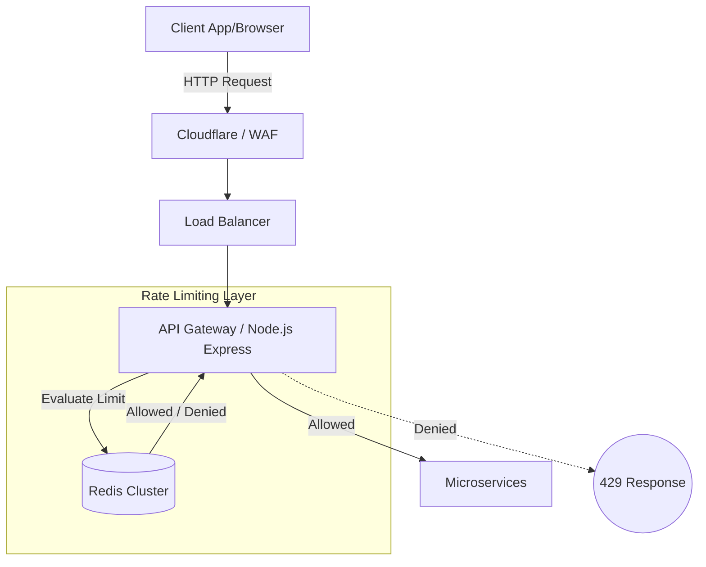

# High-Level Design (HLD): Distributed Rate Limiter

## 1. System Architecture
We will implement the rate limiter as a Middleware layer executing on our API Gateway (or main application load balancers). To ensure limits are enforced globally across all our stateless application instances, state will be maintained in a dedicated **Redis Cluster**.

## 2. Component Diagram

## 3. Core Workflow (Happy Path)
1. Request arrives at API Gateway.
2. Middleware extracts the identifier (API Key or IP).
3. Middleware queries Redis to check token availability.
4. **Redis executes an atomic Lua script** to check tokens, decrement them if available, and update the state.
5. If tokens > 0: Request proceeds to the backend.
6. If tokens == 0: API Gateway immediately returns a `429 Too Many Requests` to the client.

## 4. Technology Stack
- **Compute:** Node.js (Middleware)
- **State Store:** Redis (Cluster Mode) - Memory-only, no persistence needed. A crash means limits reset, which is an acceptable tradeoff for extreme performance.
- **Algorithm Strategy:** Token Bucket with Lazy Evaluation (calculated on-demand via Lua, no background worker).

## 5. Resilience and Fallback
If the Redis cluster is unreachable or timeouts exceed 10ms, the system will "Fail Open" (allow requests to pass through). It is better to temporarily disable rate limiting than to bring down the entire API because the rate limiter failed.
