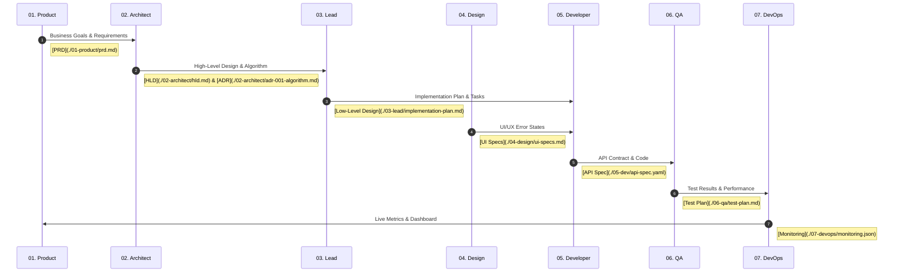

# API Rate Limiting: Project Lifecycle

This document tracks the progression of the Rate Limiting feature from concept to production.

## 🔄 Development Flow

## 📂 Artifact Links

1.  **Product Phase:** [PRD (Product Requirement Document)](./01-product/prd.md)
2.  **Architecture Phase:** [High-Level Design](./02-architect/hld.md) and [Algorithm Decision Record](./02-architect/adr-001-algorithm.md)
3.  **Lead Phase:** [Implementation Plan & Task Breakdown](./03-lead/implementation-plan.md)
4.  **Design Phase:** [UI/UX Error State Specifications](./04-design/ui-specs.md)
5.  **Dev Phase:** [OpenAPI Specification](./05-dev/api-spec.yaml)
6.  **QA Phase:** [Test Plan (Functional & Load)](./06-qa/test-plan.md)
7.  **DevOps Phase:** [Monitoring Dashboard Config](./07-devops/monitoring.json)
